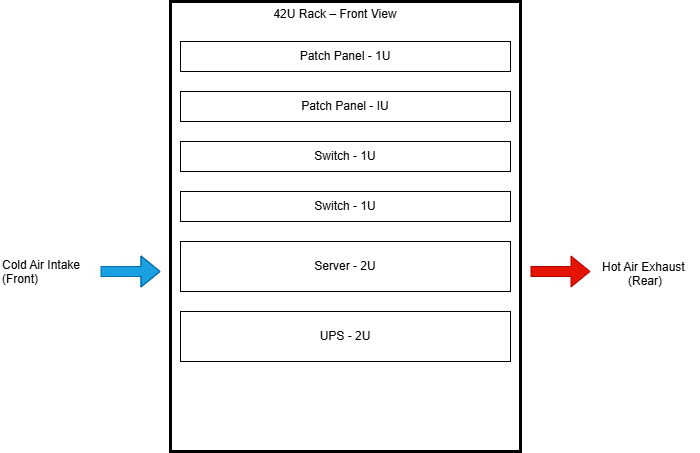

# 01 – Rack Layout & Airflow

## Objective

The objective of this lab is to demonstrate a clear, physics-aware understanding of **rack layout, device placement, airflow direction, and thermal behavior** in a standard enterprise rack environment.

This lab focuses on **why devices are placed where they are**, not just how they fit.  
Poor physical layout leads to heat buildup, instability, and outages long before logical configurations ever fail.

---

## Diagram

---

## Rack Overview (Top → Bottom)

| Position | Device | Size | Reason |
|--------|--------|------|--------|
| Top | Patch Panel | 1U | Minimal heat, frequent human interaction |
| Top | Patch Panel | 1U | Keeps cabling organized and accessible |
| Upper | Switch | 1U | Moderate heat, short cable runs from patch panels |
| Upper | Switch | 1U | Aggregation without blocking airflow |
| Mid | Server | 2U | High heat output, strong front-to-back airflow |
| Bottom | UPS | 2U | Heavy, stabilizes rack, provides power upward |

---

## Placement Rationale

### Patch Panels (Top of Rack)
- Generate negligible heat
- Require frequent human interaction
- Keep cabling off heat-producing equipment
- Reduce airflow obstruction near servers

### Switches (Below Patch Panels)
- Moderate heat output
- Benefit from proximity to patch panels
- Maintain clean cable paths
- Avoid hot exhaust zones

### Servers (Mid-Rack)
- Highest heat generation
- Designed for **front-to-back airflow**
- Positioned below switches to prevent heat from rising into network gear
- Requires clear intake and exhaust paths

### UPS (Bottom of Rack)
- Heavy battery weight
- Provides rack stability
- Supplies power upward
- Placement minimizes risk of top-heavy racks

---

## Airflow Principles

This rack assumes **front-to-back airflow**, which is standard for enterprise equipment.

- **Cold air intake** enters from the **front** of the rack
- **Hot air exhaust** exits through the **rear**
- Devices are arranged to prevent:
  - Hot air recirculation
  - Blocked intakes
  - Heat accumulation at the top of the rack

Proper airflow is critical to:
- Prevent thermal throttling
- Extend hardware lifespan
- Avoid unplanned shutdowns

---

## Failure Scenarios & Risks

### Blocked Intake
- Cabling or equipment placed too close to server intakes
- Results in heat buildup and performance degradation

### Hot Air Recirculation
- Exhaust air pulled back into the front of devices
- Causes rising internal temperatures and instability

### Poor Weight Distribution
- Heavy devices mounted too high
- Increases risk of rack tipping and physical failure

### Improper Device Order
- Servers placed above switches or patch panels
- Transfers heat upward into sensitive networking equipment

---

## Validation Checks

This rack layout is considered valid if:

- Servers have unobstructed front intake and rear exhaust
- Patch panels and switches are not exposed to server exhaust
- UPS is mounted low and secured
- Airflow direction is clearly understood and documented
- No device blocks airflow paths

---

## Key Takeaways

- Physical infrastructure failures often occur **before** logical failures
- Heat, weight, and airflow dictate rack design
- Proper layout prevents outages, not just improves aesthetics
- Understanding physical constraints is foundational to senior engineering roles

---

## Next Lab

➡️ **02 – Power Redundancy & UPS**  
This lab will expand on:
- UPS roles
- Single vs dual PDUs
- Power failure scenarios
- Redundancy design principles

