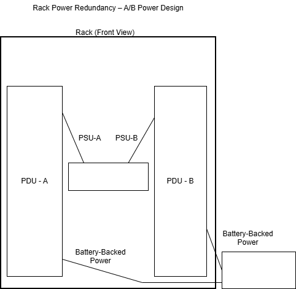

02 – Power Redundancy & UPS

Physical Infrastructure Foundations

📌 Objective

This lab demonstrates how power redundancy is implemented at the physical infrastructure layer using a UPS, dual PDUs (A/B power), and a server with dual power supplies.

The focus is on power paths and failure survivability, not device configuration.

By completing this lab, you will understand how infrastructure remains online during power loss, component failure, or maintenance events.

🧠 Concepts Covered

Purpose and limitations of a UPS

Difference between single-path vs redundant power

Role of PDU-A and PDU-B (A/B power design)

How dual power supplies provide real redundancy

Common power failure scenarios

Why redundancy exists Rosa: lives in paths, not devices

🏗️ Power Architecture Overview

This lab uses a standard enterprise A/B power model:
```bash
UPS → PDU-A → PSU-A → Server
UPS → PDU-B → PSU-B → Server
```

Each path is independent.
Failure of any single component does not result in downtime.

🖼️ Diagram – Rack Power Redundancy (A/B Power)

Rack Power Redundancy – A/B Power Design (Front View)

Figure 1: UPS-fed dual PDUs supplying a dual-PSU server using independent A/B power paths.

🔍 Diagram Explanation
UPS (Uninterruptible Power Supply)

Provides battery-backed, conditioned power

Protects against short utility power outages

Feeds power distribution, not devices directly

PDU-A / PDU-B

Independent power distribution units

Represent separate failure domains

Failure of one does not impact the other

Server (Dual PSU)

Contains two independent power supplies

PSU-A → PDU-A

PSU-B → PDU-B

⚡ Power Failure Scenarios
Scenario 1 – Utility Power Loss

UPS supplies power immediately

PDUs remain energized

Server continues running (within UPS runtime)

✅ No downtime

Scenario 2 – PDU-A Failure

PSU-A loses power

PSU-B continues via PDU-B

Server remains online

✅ No downtime

Scenario 3 – PDU-B Failure

PSU-B loses power

PSU-A continues via PDU-A

Server remains online

✅ No downtime

Scenario 4 – Single PSU Failure

Remaining PSU carries full load

Alert is generated

Service remains uninterrupted

✅ No downtime

Scenario 5 – No Redundancy (Anti-Pattern)

Single PDU

Single PSU

Single failure causes outage

❌ Downtime occurs

🚨 Key Takeaways

A UPS alone is not redundancy

Redundancy exists in power paths

Dual PSUs are ineffective without dual PDUs

PDUs define failure domains

Proper power design enables maintenance without outages

✅ Lab Completion Criteria

This lab is complete when:

The UPS feeds both PDU-A and PDU-B

The server uses two independent power supplies

Each PSU connects to a different PDU

Any single component failure does not interrupt service

All criteria have been met.

🔗 Related Labs

01 – Rack Layout & Airflow

03 – Grounding, Bonding & Electrical Safety (next)

🏁 Summary

This lab establishes a foundational understanding of enterprise power redundancy.

The principles demonstrated here apply directly to:

Data centers

Enterprise server rooms

Cloud provider physical infrastructure

High-availability system design

Power redundancy is not optional — it is fundamental.


